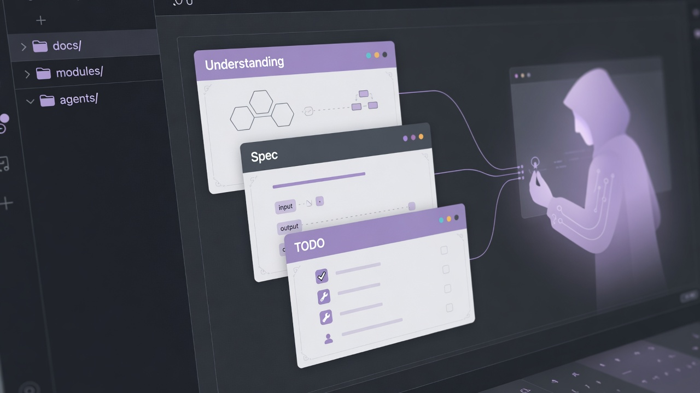

# Agentic Doc Templates

<p align="center">
  
</p>

> **Stop coding agents from losing intent or building the wrong product shape.**  
> Modular Understanding / spec / TODO docs plus tool-agnostic agent playbooks — so Cursor, Grok Build, Claude Code, Copilot, OpenClaw, and friends stay aligned across chats, not just one clever session.

[](https://creativecommons.org/licenses/by/4.0/)


---

## If this sounds like you

Use this pack when any of these keep happening:

- The agent **forgets** decisions from last week and treats every chat as greenfield  
- It **builds a different product** than you meant (wrong architecture, wrong surfaces, “helpful” scope creep)  
- Intent lives only in **Grok.com / ChatGPT / Discord threads** and never becomes durable project docs  
- **`AGENTS.md` or always-on rules** grew into a second codebase and still don’t fix drift  
- TODOs say done but nothing is **operable** (library checklist ≠ product you can run)  
- You jump between **Cursor, Grok Build, Claude, OpenClaw** and want the **same** docs workflow  

---

## What this is / is NOT

| This **is** | This is **not** |
|-------------|-----------------|
| Repo-owned **modular docs** + short **agent playbooks** agents open on demand | Another **coding agent runtime** (not a Cursor/Claude/Prime-Agent replacement) |
| A small `docs/` map: Master Index, features, Understandings, specs, TODOs, Human-TODO | Notion / Linear / a hosted PM product |
| Tool-agnostic install (Cursor rules, Grok agents, Claude, Copilot, `AGENTS.md`, …) | One mega always-on rule file that tries to be the whole process |
| **Docs profiles** (`prevent` · `ship-first` · `balanced`) and **orchestrate** loops | A memory OS, vector DB, or self-improving harness product |

You still pick your agent. This pack is what that agent **reads and updates** so intent survives the next session.

---

## Pick a docs profile — first-class, not a concession

**`ship-first` is a real default for the right products.** `prevent` is the right default when identity is expensive to get wrong. Unset still treats as `prevent` so existing identity-risky repos do not silently drop the gate. Bootstrap suggests a mode from your `docs/reference/` and asks once.

| Your product | Profile | Why |
|--------------|---------|-----|
| **Typed APIs, CRUD services, clear contracts** | **`ship-first`** | Spec + TODO from day one. Shape is already the types / routes. This is the *correct* default here — not “ceremony off for people in a hurry.” |
| **Editors, games, multi-surface apps** | **`prevent`** | Understanding + you confirm is / is *not* before code. A “helpful” agent will otherwise build the wrong engine, the wrong surface, or a second product. |
| Mid-size / mixed signals | **`balanced`** | Understanding only when identity is fuzzy (competing surfaces, “not X”, split pressure, or you say *lock shape*). |

Public example of this pack on a typed API: **[xAIkit](https://github.com/BrianCLowe/xAIkit)**.

---

## How it works

AI coding agents drift when intent lives only in chat. This pack gives them a small, consistent `docs/` layout. You pick a **docs profile** at bootstrap (table above) — that choice is the product, not an afterthought.

1. You capture ideas — **recommended:** export chat threads (Grok.com, ChatGPT, …) to markdown and drop them in `docs/reference/` (often many files; they keep whys that polished design docs lose). Or talk the idea through with your **coding agent** in the IDE and have it **build or update live docs as you go**.
2. At bootstrap the agent asks **project preferences in one batch** (docs profile, sync mode, orchestrator git, optionals) — not a drip of five separate quizzes.
3. Under **prevent**, **you confirm shape** (is / is *not* + Assumptions) before code. Under **ship-first**, implement from TODOs and grow the spec; *lock shape* anytime identity gets sharp.
4. Work continues from TODOs and specs. For a single slice: *Continue from Current focus.* For a long run: **orchestrate** — *Orchestrate — clear ready TODOs until blocked.* The parent session loops implement → verify → next milestone (git via **`orchestrator.git.mode`**: recommend **milestone-pr** so overnight work lands as reviewable PRs — several related TODOs and concurrent implementers when they do not overlap **and** the host can isolate them, squash before ready, CI/Bugbot, then merge — or **branch-pr-squash** for one morning PR, or **current-push** if you set “push the branch I’m on”). The pack does not create git worktrees; already-in-a-host-worktree stays put.

Short asks are enough: *bootstrap*, *draft Understanding for X*, *orchestrate*, *update the doc templates*. The agent routes to the matching playbook inside `docs/templates/`. Tips: [`docs/templates/help/IDEA_CAPTURE_TIPS.md`](docs/templates/help/IDEA_CAPTURE_TIPS.md). Scaffolds vs teaching: [`docs/templates/help/SCAFFOLDS.md`](docs/templates/help/SCAFFOLDS.md). Orchestrator: [`docs/templates/agent/roles/orchestrator.md`](docs/templates/agent/roles/orchestrator.md).

---

## Get started

Goal: get **`docs/templates/`** into your project, then let the agent create live docs. Deeper notes: [`docs/templates/help/SETUP.md`](docs/templates/help/SETUP.md).

### 1. Get the pack *(pick one)*

| Method | When | What to do |
|--------|------|------------|
| **Download release** | Existing project; prefer the GitHub website | Open [**Releases**](https://github.com/BrianCLowe/Agentic-Doc-Templates/releases), download **`agentic-doc-templates-X.Y.Z.zip`** (not “Source code”), extract into your **project root** so you get `docs/templates/` |
| **Copy `docs/templates/`** *(recommended for existing apps)* | You already have a repo | Clone or browse this repo, copy only **`docs/templates/`** → `your-project/docs/templates/` so pack root files never collide with yours |
| **Use this template** | Brand-new GitHub repo | Click **Use this template** (green button), clone your new repo. You get the whole pack tree; bootstrap will clean pack-owned root files |
| **Clone → rename → change remote** | New local app starting from this repo | `git clone` this repo, rename the folder to your app name, `git remote set-url origin <your-repo-url>` (create the empty GitHub repo first if needed). Same whole-repo layout as the template path — bootstrap cleans pack root / Agentic-only `.github/` |

After any method you should have **`docs/templates/`** (with `agent/BOOTSTRAP.md` inside). Prefer **copy `docs/templates/` only** into an existing app when you can.

### 2. Bootstrap *(first install)*

Ask your agent:

> Bootstrap modular docs using `docs/templates/agent/BOOTSTRAP.md`.

That creates the live `docs/` layout (Master Index, `reference/`, feature folders, …). On whole-repo / template installs it also auto-moves this pack’s root README/LICENSE/CONTRIBUTING into `docs/templates/agent/upstream/` when those files are clearly from Agentic Doc Templates, and **deletes pack-only leftovers** (issue forms, `FUNDING.yml`, `release.yml`, `pack-checks.yml`, `.cursor/environment.json`, root `eval/`, `scripts/gen_role_adapters.py`, leftover `docs/templates/agent/scripts/*.py`, maintainer `DECISIONS.md`) — bootstrap Steps 1b–1d. Prefer **copy `docs/templates/` only** so those files never land in your app.

### 3. Build live docs from ideas

1. Work ideas out in Grok.com / ChatGPT / etc. and **export** threads to markdown ([tips](docs/templates/help/IDEA_CAPTURE_TIPS.md#recommended-export-idea-chats-into-docsreference)).
2. Drop exports (and any design docs) into **`docs/reference/`**.
3. Ask: *Build or update the live docs from `docs/reference/`.*
4. Review draft Understandings before coding. Under **prevent**, also skim `docs/Product-Vision.md` — one end-state picture the feature map must fit.

You can brainstorm before the repo exists — export now, drop into `reference/` after bootstrap.

### 4. Stay current *(later updates)*

When this pack improves, do **not** re-bootstrap. Ask:

> Update the doc templates from Agentic Doc Templates and sync our live docs.

The agent refreshes `docs/templates/`, then follows [`CHANGELOG.md`](docs/templates/CHANGELOG.md) for live-doc catch-up. Optional version ping: *Check for template updates.* — [`TEMPLATE_UPDATE_CHECK.md`](docs/templates/agent/TEMPLATE_UPDATE_CHECK.md).

**One-time catch-up:** If your pack is from **before 1.2** (no `agent/TEMPLATE_SYNC.md`), replace `docs/templates/` once from a current release so sync playbooks exist locally.

### Cursor plugin note

**Compound Engineering** and **Superpowers** often override the modular-docs Cursor rule. Disable them (or their always-on skills) for this workspace if you rely on this pack. Details: [`USING_WITH_AGENTS.md`](docs/templates/help/USING_WITH_AGENTS.md#cursor-conflict-note).

---

## What’s in the pack

Everything ships under **`docs/templates/`**. Live project docs stay at `docs/` root.

| Area | Role |
|------|------|
| **Scaffolds** | Master Index, Product vision, Understanding, Spec, TODO, Tooling, Human-TODO, optional Team-Roster, Decision templates |
| **[`help/`](docs/templates/help/)** | Human guides — [SETUP](docs/templates/help/SETUP.md), [USAGE](docs/templates/help/USAGE.md), [SCAFFOLDS](docs/templates/help/SCAFFOLDS.md), [IDEA_CAPTURE_TIPS](docs/templates/help/IDEA_CAPTURE_TIPS.md), [USING_WITH_AGENTS](docs/templates/help/USING_WITH_AGENTS.md) |
| **[`agent/`](docs/templates/agent/)** | [`Modular_Docs_Workflow.md`](docs/templates/agent/Modular_Docs_Workflow.md), bootstrap, [`RULE_INSTALL`](docs/templates/agent/RULE_INSTALL.md) → per-tool [`tools/`](docs/templates/agent/tools/README.md), template sync; optional [`roles/`](docs/templates/agent/roles/README.md) (Cursor/Grok/Copilot adapters shipped 2.7.23+ — never always-on) |
| **[`VERSION`](docs/templates/VERSION)** / **[`CHANGELOG.md`](docs/templates/CHANGELOG.md)** | Cheap upstream compare + sync scope after a pack refresh |

---

## Live docs layout

After bootstrap, a typical project looks like:

```
docs/
├── Master_Index.md              ← project map (you maintain)
├── Product-Vision.md            ← whole-product end-state (**prevent**; skip on ship-first unless you lock product shape)
├── Tooling.md                   ← machine tools (not package deps)
├── Human-TODO.md                ← human inbox (procure, playtest, decide, waiting)
├── Team-Roster.md               ← optional — only when team inbox is on (named humans and bots self-ID; do not invent)
├── ADT-settings.yaml            ← pack prefs (profile, git, standing playbook overrides, tools, optionals, sync, upstream)
├── reference/                   ← design docs, chat exports, PRDs, legacy specs
│   └── visuals/                 ← optional inspiration screenshots
├── _shared/                     ← reusable components (same note types as features)
│   └── ComponentName.md (+ Understanding, TODO)
├── features/
│   └── FeatureName.md (+ Understanding, TODO)
├── decisions/                   ← optional cross-cutting decisions
└── templates/                   ← this pack (overwrite on sync; not live content)
```

Flat sibling files per feature/shared component. Naming: [`Modular_Docs_Workflow.md` §0](docs/templates/agent/Modular_Docs_Workflow.md#0-naming--file-layout-read-before-creating-files).

---

## Ideas that guide the pack

- **Simplicity** — Short user asks; agents follow one playbook.
- **Understanding before code** — Agent drafts shape/guardrails; you confirm is / is not (not the full contract).
- **Product vision** — One end-state picture the feature map must fit (prevent). A complete map is not identity.
- **Modular map** — Small files + Document Map; not one giant spec.
- **Tight scope** — Paved path for the current ask; no “just in case” audits.
- **One folder to copy** — `docs/templates/` holds setup, workflow, and rules so your `docs/` root stays yours.
- **User workflow wins where safe** — first-class settings where the pack has enums; **standing** when you override a playbook and no key exists (not a notes pad).

Deeper day-to-day patterns: [`docs/templates/help/USAGE.md`](docs/templates/help/USAGE.md).

---

## Example prompts

- *Bootstrap modular docs using `docs/templates/agent/BOOTSTRAP.md`.*
- *Draft Understanding for [feature] from what I said — I’ll review.* *(main agent delegates to Understanding author subagent if installed)*
- *Orchestrate — clear ready TODOs until blocked.* *(parent-session loop: implement → verify → next)*
- *Update the doc templates from Agentic Doc Templates and sync our live docs.*
- *Check for template updates.*
- *Build or update the live docs from `docs/reference/`.*
- *Todo cleanup — move completed items to Completed.*

More: [`USAGE.md`](docs/templates/help/USAGE.md).

---

## Contributing

PRs that improve the templates or workflows are welcome. Prefer focused changes; when bumping [`VERSION`](docs/templates/VERSION), update [`CHANGELOG.md`](docs/templates/CHANGELOG.md) in the same commit. **`VERSION` is the only place the pack version number lives** — do not copy it into scaffolds, README badges, or examples.

Pack-maintainer decisions (so we cannot silently undo one): root [`DECISIONS.md`](DECISIONS.md) — bootstrap deletes it from user copies.

**Feedback:** [Open an issue](https://github.com/BrianCLowe/Agentic-Doc-Templates/issues/new/choose). Discussions for open-ended questions. See [`CONTRIBUTING.md`](CONTRIBUTING.md).

---

## License

[CC BY 4.0](https://creativecommons.org/licenses/by/4.0/) — see [LICENSE.md](LICENSE.md).

When reusing or adapting:

> Based on [Agentic Doc Templates](https://github.com/BrianCLowe/Agentic-Doc-Templates) by Brian Lowe, licensed under CC BY 4.0.
